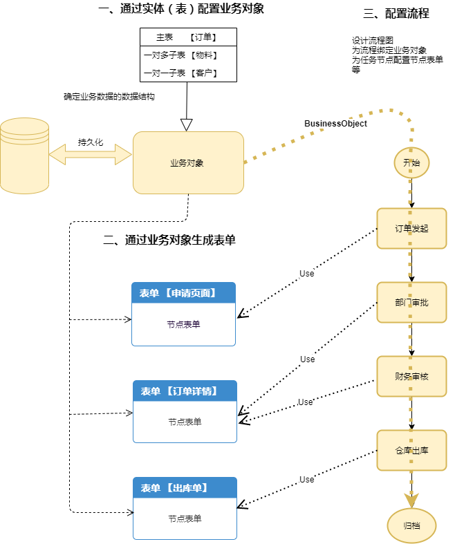

# 敏捷实施

## 解决方案概览
通过 业务对象、表单、流程引擎 共同协作来解决业务流难实施的痛点。

业务对象用来承载、持久化业务数据；表单则是业务数据的展示层；流程则用来驱动业务数据流转。三者共同协作完成流程实施。

- 业务对象：  
由实体（表）组成，支持任意数据结构（关联关系），可以跨库来组织业务对象（支持分布式事务），而且难以置信的支持N层。
- 在线表单：  
表单完美的支撑了业务对象的展示，并支持丰富的前端组件和字段级权限控制。
- 流程引擎：  
高效、解耦、强大、灵活。流程引擎一切功能皆插件。

支持任意结构的业务对象 + 丰富控件易扩展的表单（字段级别的权限控制） + 功能强大的工作流引擎 便是完整的流程解决方案。

当然、流程也支持 url表单，方便已有业务、异构系统的流程实施。

**敏捷实施三部曲**
- 构建业务对象
  - 配置实体业务表
  - 配置业务对象
- 生成表单
  - 生成表单
  - 配置表单
- 流程实施
  - 绘制流程图
  - 流程配置
  - 发起流程

## 流程设计
参考 Acitivi文档
