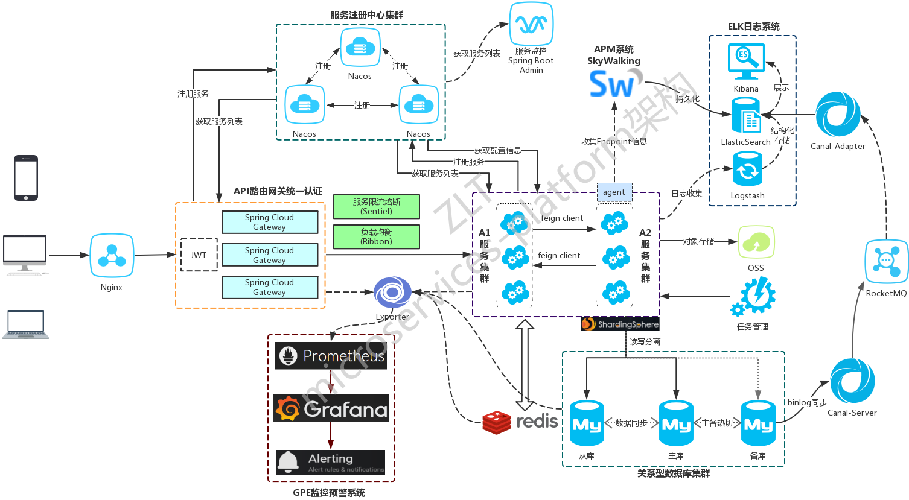
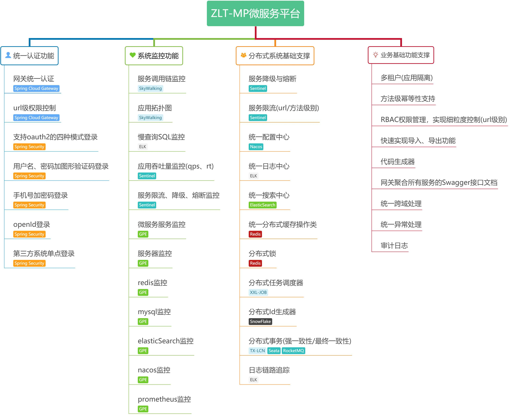

## 微服务架构

开源企业微服务架构平台

EA-MSP (Enterprise Arch - MicroService Platform)

详细介绍参见 [EA-MSP](ea-msp/README.md)

## 微服务框架案例参考

* ZLT microservices-platform

基于SpringBoot2.x、SpringCloud和SpringCloudAlibaba并采用前后端分离的企业级微服务多租户系统架构。并引入组件化的思想实现高内聚低耦合并且高度可配置化，适合学习和企业中使用。
真正实现了基于RBAC、jwt和oauth2的无状态统一权限认证的解决方案，面向互联网设计同时适合B端和C端用户，支持CI/CD多环境部署，并提供应用管理方便第三方系统接入；同时还集合各种微服务治理功能和监控功能。
模块包括:企业级的认证系统、开发平台、应用监控、慢sql监控、统一日志、单点登录、Redis分布式高速缓存、配置中心、分布式任务调度、接口文档、代码生成等等。

https://gitee.com/zlt2000/microservices-platform    
https://www.kancloud.cn/zlt2000/microservices-platform/919412   

技术架构图

功能清单图

* open cloud / open cloud pro

基于springcloud、oauth2、nacos打造的微服务开放平台. 利于企业分布式开发,集中管理微服务接口,SpringSecurity深度拓展,为微服务接口资源保驾护航。

https://github.com/liuyadu/open-cloud    
https://github.com/liuyadu/open-admin-ui   
https://gitee.com/liuyadu/open-cloud/wikis/pages   

技术架构图(opencloud)

功能清单图(opencloud)

技术架构图(opencloud pro)

