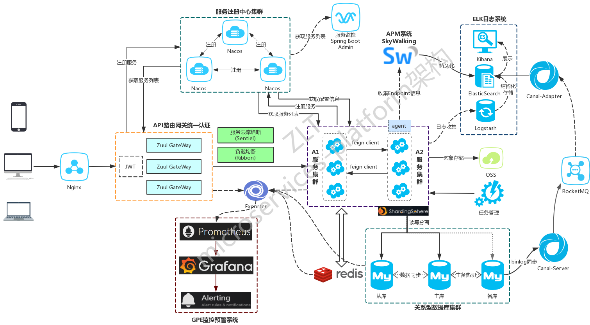

开源企业微服务架构平台

EA-MSP (Enterprise Arch - MicroService Platform)

## 项目简介

- 演示环境有全方位的监控示例：日志系统 + APM系统 + GPE系统
- 前后端分离的企业级微服务架构
- 基于Spring Boot 2.0.X、Spring Cloud Finchley和Spring Cloud Alibaba
- 主要针对解决微服务和业务开发时常见的非功能性需求
- 深度定制Spring Security真正实现了基于RBAC、jwt和oauth2的无状态统一权限认证的解决方案
- 面向互联网设计，同时适合B端和C端用户
- 支持CI/CD多环境部署
- 提供应用管理，方便第三方系统接入，支持多租户(应用隔离)
- 引入组件化的思想实现高内聚低耦合并且高度可配置化
- 注重代码规范，严格控制包依赖，每个工程基本都是最小依赖
- 非常适合学习和企业中使用

系统架构图

## 项目文档
### 核心功能
详细参见 [核心功能清单](项目介绍-核心功能.md)
- 统一认证功能
- 分布式系统基础支撑
- 系统监控功能
- 业务基础功能支撑

### 开发说明及核心接口
- 开发说明-登录认证

- 核心接口-[登录认证接口](核心接口-登录认证.md)
  - 用户名密码+验证码登录
  - 通过openId获取token
  - 第三方系统接口对接方式
  - 第三方系统单点登录
  - 账号登出接口
  - 通用刷新token

- 开发说明-基础功能
  - Redis使用
  - 统一异常处理
  - 日志埋点工具
  - 方法级幂等性
  - 审计日志
  
- 开发说明-分布式功能
  - 分布式锁
  - 分布式id生成器
  - 分布式事务
    - 同步强一致性
    - 异步最终一致性
  - 分库分表sharding-sphere
  - 消息队列   集成Spring-Cloud-Stream+RocketMQ

### 系统设计
- [微服务总体分层架构图](系统设计-微服务总体分层架构.md)
- [服务认证架构设计](系统设计-服务认证架构设计.md)
- [服务URL级权限控制](系统设计-服务URL级权限控制.md)
- 日志解决方案设计
- 监控架构设计

### 企业级功能
- alibaba/nacos注册中心
- 统一日志中心详解
- 慢查询sql详解
- 审计日志-elk详解
- alibaba/sentinel限流熔断
- JWT的RSA非对称密钥生成
- Docker
- APM监控-SkyWalking
- Metrics监控
- 分布式事务
- MySQL
- Redis
- 数据库之分库分表
- 消息队列
- FastDFS分布式文件系统
- Canal数据库日志解析消费
- 多租户(应用隔离)
- 分布式日志链路跟踪
- [单点登录详解](功能讲解-单点登录.md)
