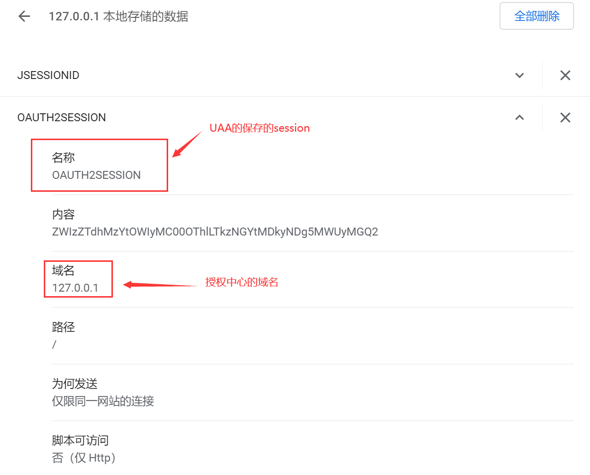
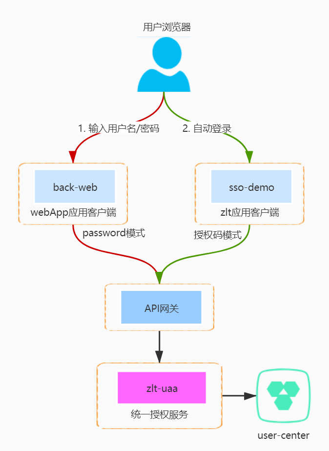
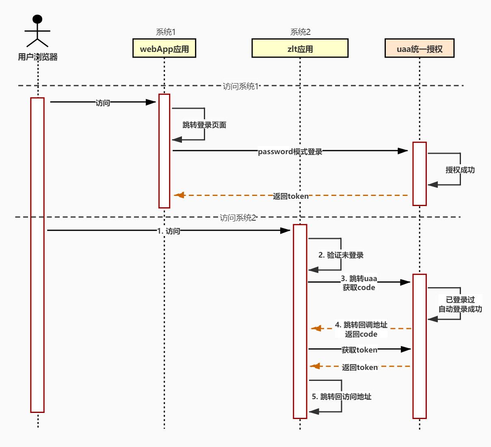

# 单点登录详解

## 一、原理说明
### 1.1. 基本原理

SSO单点登录是基于共享uaa授权中心的cookie来实现的，大概流程如下：
1) 当**系统1**登录成功后
2) **uaa授权中心**里面会保存了**系统1**中的登录信息建立全局会话，并把自己的cookie写到用户的浏览器中
3) 当同一个浏览器访问**系统2**时，当跳转到**uaa授权中心**授权时会把浏览器中uaa的cookie也带过去
4) uaa授权中心根据自己的cookie判断该浏览器的用户已经登录过，则自动登录完成**单点登录**
 

### 1.2. 架构图

> webApp应用可以使用其他oauth2模式登录不一定必需password模式，但是如果多个系统之间不同域(跨域)则必需使用授权码或者简单模式

 

### 1.3. OAuth 2.0 四种授权模式

- Authorization Code: 用在服务端应用之间，这种最安全也最复杂
- Implicit: 用在移动app或者web app(这些app是在用户的设备上的，如在手机上调起微信来进行认证授权)
- Resource Owner Password Credentials(password): 应用直接都是受信任的(都是由一家公司开发的)
- Client Credentials: 用在应用间API访问
 

### 1.4. 单点时序图
 

### 1.5. 单点登录的请求步骤

下图是访问sso-demo的地址 http://127.0.0.1:8080 时 `@EnableOAuth2Sso` 注解与`UAA授权中心`通过`Oauth2授权码模式`交互完成单点登录的步骤


> 结合上面单点时序图中访问系统2的1~5步

### 1.6. 基于`Spring Security`实现
```
@EnableOAuth2Sso
@Configuration
public class SecurityConfig extends WebSecurityConfigurerAdapter {
  @Value("${security.oauth2.sso.login-path:}")
  private String loginPath;

  @Override
  public void configure(HttpSecurity http) throws Exception {
    http.authorizeRequests().anyRequest().authenticated()
        .and()
        .csrf().disabled();
    if (StrUtil.isNotEmpty(loginPath)) {
      http.formLogin().loginProcessingUrl(loginPath);
    }
  }
}
```
最简单的方式就是使用`Spring Security`的`@EnableOAuth2Sso`注解，该注解会自动添加一个认证过滤器，自动完成`授权码模式`的oauth2授权流程

> 如果不是使用Spring Security框架或者不想用授权码模式怎么办？按照原理自己实现即可
```
ea-msp:
  api-uaa:
    url: http://127.0.0.1:9900/api-uaa/oauth

security:
  oauth2:
    sso:
      login-path: /singleLogin
    client:
      client-id: app1
      client-secret: app1-sec
      access-token-uri: ${ea-msp.api-uaa.url}/token
      user-authorization-uri: ${ea-msp.api-uaa.url}/authorize
    resource:
      token-info-uri: ${ea-msp.api-uaa.url}/check_token 
```
> security.oauth2.sso.login-path：设置回调地址(默认是/login)

## 二、注意事项
### 2.1. 授权类型

应用的授权类型需要支持`授权码模式`参考上图#2位置，应用的`authorized_grant_types`字段需要支持授权码模式

### 2.2. 回调地址


回调地址必需与应用配置的地址一致，参考上图的#3位置，可以通过·security.oauth2.sso.login-path·配置指定回调地址，否则会出现错误

### 2.3. 单点的系统间访问uaa的域名必需一致
由于原理是`共享uaa授权中心`的`cookie`，首先需要使用同一个浏览器访问，并且不同系统跳转uaa时所使用的域名必需一致才能`共享cookie`

> 一个用域名访问uaa,另一个用ip访问uaa不行  
  一个用localhost访问uaa, 另一个用127.0.0.1访问uaa也不行
