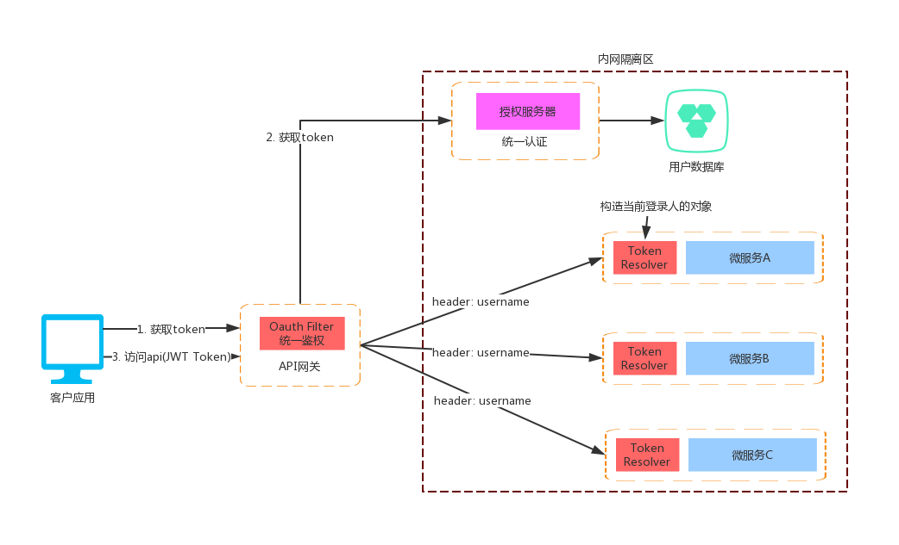
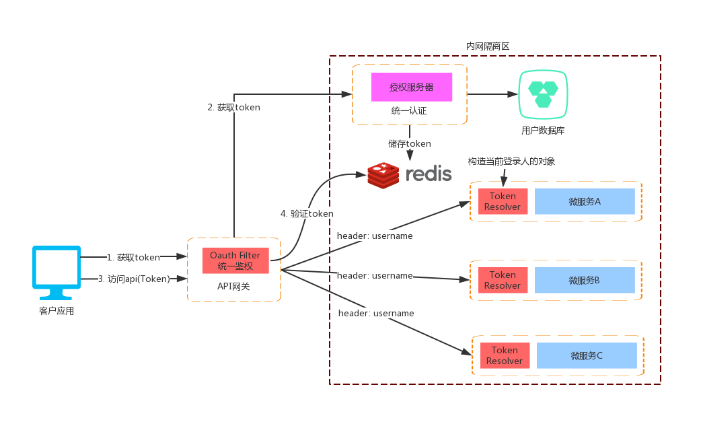
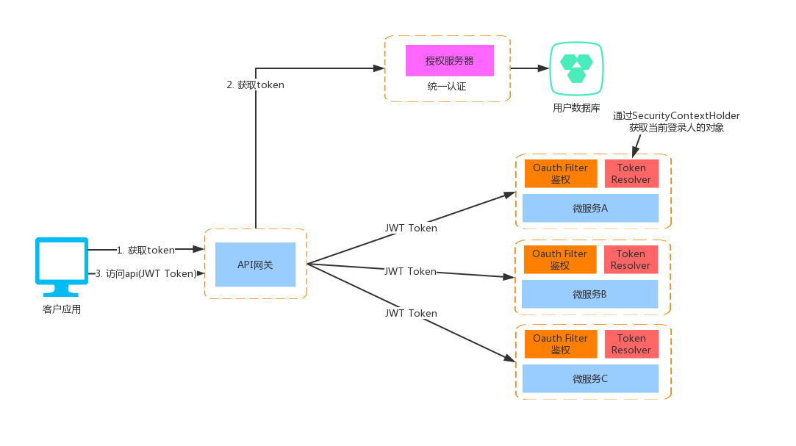
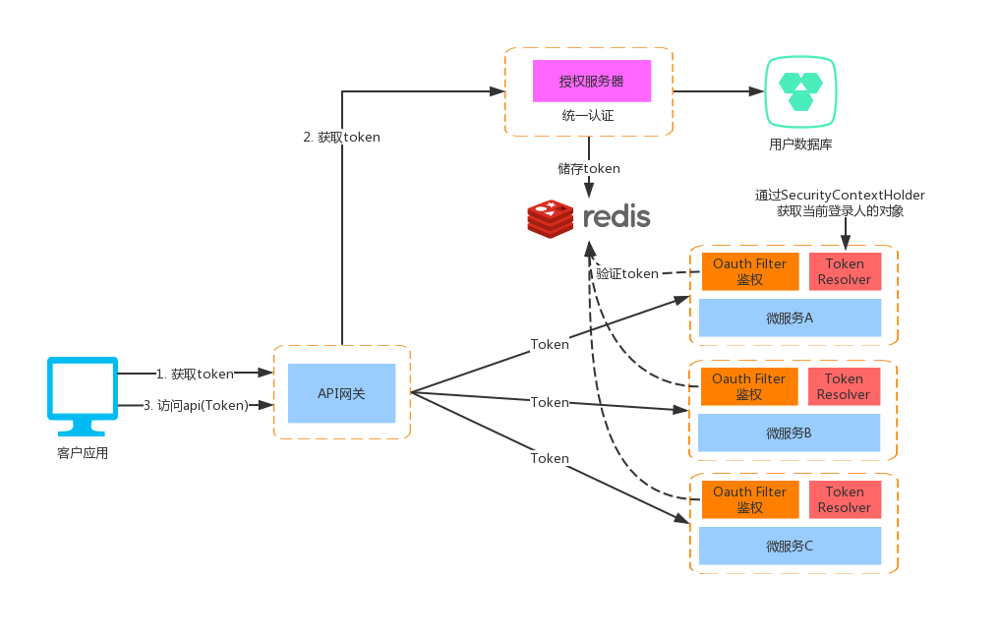
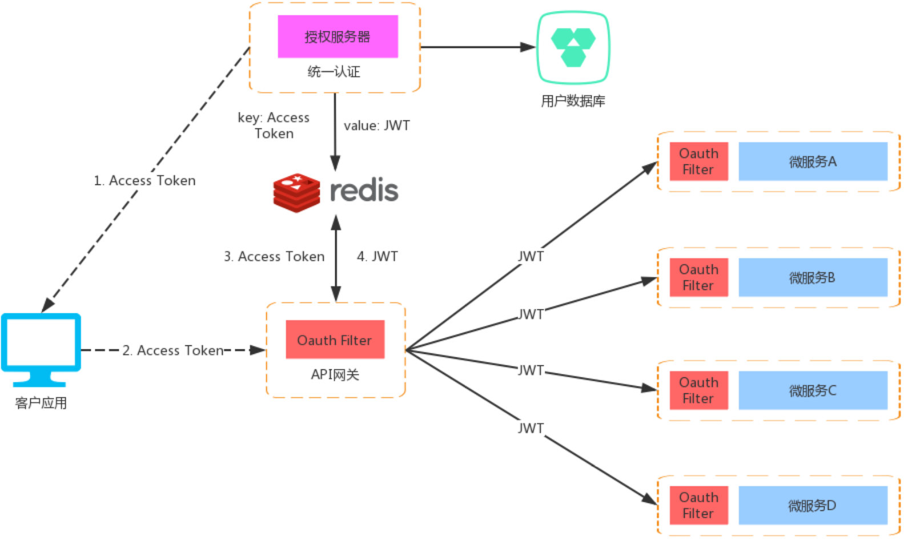

企业级服务认证架构设计

## 有网络隔离
### 一、环境说明
网络隔离是指用户访问的网络环境只能访问负载均衡/API网关，而访问不了后面的微服务机器

### 二、架构图
1. JWT

2. Redis

### 三. 设计思路
- **统一认证**：负责登录认证、token派发、token刷新、应用接入管理等功能
- **API网关**：添加认证中心的sdk负责所有请求的鉴权，包括登录验证和url级别的权限判断，主要的JWT原理如下：
  1. 拦截请求获取判断是否带有token参数(parameter和header)
  2. 通过公钥pubkey.txt解密token
  3. 判断token中的权限信息是否能访问当前url
  4. 把用户名和角色信息放到请求的header中，传给后面的微服务
- **TokenResolver**：嵌入在微服务程序中负责获取当前登录人，主要原理如下：
  1. 判断当前url请求的方法有没有带有`@LoginUser`注解
  2. 判断`@LoginUser`注解的`isFull`属性是否为`true`则通过`username`查询用户对象
  3. 构建`SysUser`对象传给目标方法
 
## 无网络隔离V1
### 一、环境说明
无网络隔离是指用户访问的网络环境与整个系统的部署网络环境是相通的，例如用户可以绕过API网关直接访问后台的服务

### 二、架构图
1. JWT

2. Redis

### 三. 设计思路
- **统一认证**：负责登录认证、token派发、token刷新、应用接入管理等功能
- **API网关**：只负责路由转发
- **微服务**：每个服务都需加入认证中心的sdk负责所有请求的鉴权
- **TokenResolver**：嵌入在微服务程序中通过SecurityContextHolder获取当前登录人，主要原理如下：
  1. 判断当前url请求的方法有没有带有`@LoginUser`注解
  2. 判断`@LoginUser`注解的`isFull`属性是否为`true`则通过`username`查询用户对象
  3. 构建`SysUser`对象传给目标方法
  
 
## 无网络隔离V2
### 一、环境说明
无网络隔离的情况下需要保证每个服务的API访问都要进行认证

### 二、架构图

### 三、设计思路
在V1的架构基础上进行改进保证每个服务的API都有认证，并且客户端与服务内部分别使用不同的token同时融合了redisToken和jwt两者的优点

- 客户端使用redisToken
  - 减少网络带宽消耗：普通的uuid token对于jwt的长度小很多
  - 能实现更多的功能：使用redisToken功能更多，能方便实现如token自动续约、在线用户列表、踢人等功能
- 内部服务使用jwt
  - 场景符合：由于是内部服务使用，客户端只能获取access token没有jwt，所以无需让jwt token失效符合jwt特性
  - 提升性能：服务与服务之间的通信只需通过jwt自解析认证，无需网络连接，大大减少redis的压力和提升性能
  - 增加安全性：内部服务与客户端所使用的token不一样，能有效防止客户端绕开网关直接请求后面服务
 
### 四、实践思路
1. 自己实现一个`RedisTokenStore`在`storeAccessToken`的时候使用私钥生成`JWT`并存到Redis中
2. 网关添加过滤器在认证`access_token`成功后，获取`JWT`存到`header`中请求后面的内部服务
3. 每个内部服务都添加`@EnableResourceServer`配置为资源服务器，并且`ea-msp.oauth2.token.store`设置为`resJwt`使用公钥自解析`JWT`

## token自动续签设计(Redis Token)

### 一、说明
本设计只针对`redis token`模式，该模式下的续签建议**只修改过期时间**而不重新生成token，因为重新生成token会导致同一个账号下的其他客户端访问失效

> 续签会有性能开销，所以设计了开关和黑白名单方便灵活控制，只有真正需要的业务才开放
